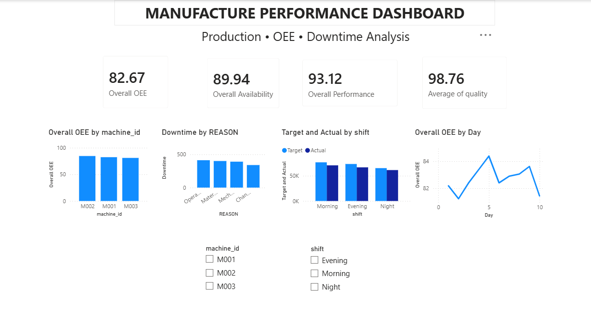

# Manufacturing Performance & OEE Analytics Dashboard

An end-to-end manufacturing analytics project using MySQL, SQL, and Power BI to analyze production performance, equipment efficiency, and downtime.

## Overview

The objective of this project is to analyze manufacturing production data and identify performance gaps across machines, shifts, and downtime categories.

The analysis focuses on four key manufacturing KPIs:

1. Overall Equipment Effectiveness (OEE)
2. Availability
3. Performance
4. Quality

SQL was used for data preparation, aggregation, KPI calculations, and analysis. Power BI was then used to build an interactive dashboard for visualizing the results.

## Tools Used

- MySQL
- SQL
- Power BI
- CSV

## Dataset

The project uses two main datasets.

### Production Data

Contains production-level information including:

- Production ID
- Machine ID
- Production Date
- Shift
- Product
- Target Quantity
- Actual Quantity
- Production KPIs

### Downtime Data

Contains information about downtime events including:

- Downtime ID
- Production ID
- Downtime Reason
- Downtime Duration in Minutes

## Project Workflow

Production & Downtime Data
        ↓
      MySQL
        ↓
  SQL Data Analysis
        ↓
 KPI / OEE Calculations
        ↓
    Power BI
        ↓
Interactive Dashboard
        ↓
 Business Insights

## Analysis

SQL was used to:

1. Explore and validate production and downtime data
2. Aggregate production records
3. Calculate OEE-related KPIs
4. Analyze machine-wise performance
5. Analyze downtime by reason
6. Compare target and actual production
7. Analyze production performance across shifts
8. Create the KPI view used for the Power BI dashboard

## Power BI Dashboard

The dashboard includes:

### KPI Cards

- Overall OEE
- Availability
- Performance
- Quality

### Visualizations

- OEE by Machine
- Downtime by Reason
- Target vs Actual Production by Shift
- Daily OEE Trend

### Filters

- Machine
- Shift

## Dashboard

## Dashboard Analysis and Insights

### Overall Manufacturing Performance

The overall OEE was **82.67%**, with:

- Availability: **89.94%**
- Performance: **93.12%**
- Quality: **98.76%**

The high quality score indicates that product quality remained strong. The lower OEE suggests that availability and performance losses are contributing to the overall efficiency gap.

### Machine-wise OEE

| Machine | Average OEE |
|---------|-------------|
| M001 | 82.40% |
| M002 | 84.58% |
| M003 | 81.00% |

**M002** recorded the highest average OEE at **84.58%**, while **M003** recorded the lowest at **81.00%**.

The 3.58 percentage-point difference indicates variation in equipment performance. M003 can therefore be considered a potential area for further investigation.

### Downtime Analysis

| Downtime Reason | Total Downtime |
|-----------------|----------------|
| Operator Delay | 413 min |
| Material Shortage | 401 min |
| Mechanical Failure | 391 min |

**Operator Delay** was the largest contributor with **413 minutes** of downtime, followed by Material Shortage and Mechanical Failure.

Since the difference between the three categories is relatively small, improvement efforts should consider all three areas rather than focusing only on operator delays.

### Target vs Actual Production

| Shift | Target | Actual | Gap |
|-------|-------:|-------:|----:|
| Shift 1 | 76,880 | 70,880 | 6,000 |
| Shift 2 | 73,590 | 66,890 | 6,700 |
| Shift 3 | 65,370 | 61,500 | 3,870 |

**Shift 2** recorded the largest production gap of **6,700 units**.

Shift 3 had the smallest absolute gap at **3,870 units**.

The larger gap in Shift 2 suggests that factors such as downtime, machine performance, or operating conditions could be investigated further.

### Daily OEE Trend

The daily OEE trend showed noticeable fluctuations across production days rather than a consistent upward or downward pattern.

OEE reached approximately **84.4%** at its highest point and dropped to around **81%** at lower points during the period.

This variation suggests that equipment performance was not completely consistent across production days and that lower-performing days could be investigated further.

## Key Takeaways

1. **M003** has the lowest machine-level OEE and may require further performance analysis.
2. **Operator Delay** contributes the highest downtime among the analyzed reasons.
3. **Shift 2** has the largest target-to-actual production gap.
4. **Daily OEE fluctuates**, indicating variation in equipment performance across production days.

The dashboard demonstrates how manufacturing data can be transformed into actionable insights for monitoring production efficiency, identifying downtime drivers, and highlighting areas for operational improvement.

## Project Files

- `manufac_kpi.csv` — Production KPI dataset
- `downtime.csv` — Downtime dataset
- `manufacturing_performance_project.sql` — Main SQL analysis
- `studyofmanufacturing.sql` — Supporting SQL queries
- `manufac_performance_dash.pbix` — Power BI dashboard
- `Dashboard.png` — Dashboard preview
